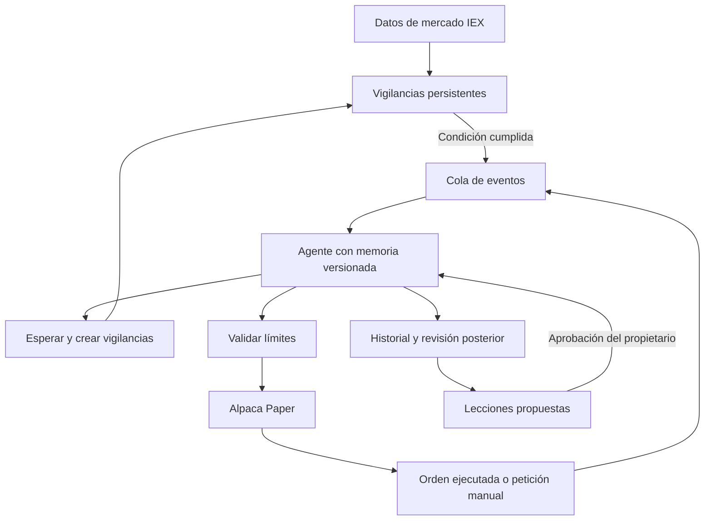

<div align="center">


# Meridian

### Un laboratorio personal para observar, evaluar y evolucionar un agente de inversión.

**Mercado por eventos · Memoria con evidencia · Autonomía con límites**

[](https://github.com/Dasge97/Meridian/actions/workflows/ci.yml)


[Inicio rápido](#inicio-rápido) · [Cómo funciona](#cómo-funciona) · [Despliegue](docs/DEPLOYMENT.md) · [Arquitectura](docs/ARCHITECTURE.md)

</div>

---

Meridian conecta un agente a **Alpaca Paper Trading** y conserva lo necesario para entender cada decisión: qué información tenía, qué esperaba, qué hizo y qué observó después. Su panel está pensado para un propietario y su servidor personal.

El agente puede dejarse vigilancias: «si el precio llega a X, vuelve a analizarlo». Un proceso escucha el mercado y comprueba esas condiciones sin llamar continuamente al modelo. Cuando se cumple una, el agente reevalúa; alcanzar un precio **no obliga a comprar**.

> **Estado: primera versión funcional, exclusivamente simulación.** El código no contiene un destino de trading real. Para activarlo debes configurar tus credenciales de Alpaca Paper y de un modelo compatible, desplegarlo y completar la prueba de aceptación descrita abajo. No incluye datos ni beneficios inventados.

## Qué incluye

| Área | Funcionalidad |
|---|---|
| Panel | Patrimonio, posiciones, conexión, consumo de llamadas y actividad |
| Decisiones | Contexto guardado, hipótesis, versión, orden y revisión posterior |
| Vigilancias | Precio ≤ / ≥, caducidad, invalidación, activación única y cancelación |
| Aprendizaje | Lecciones propuestas por el agente y conocimiento aportado por el propietario |
| Evolución | Aprobar/descartar lecciones, editar instrucciones y recuperar versiones |
| Ejecución | Órdenes limitadas de acciones enteras en Alpaca Paper, durante mercado abierto |
| Controles | Lista de activos, efectivo disponible, exposición, órdenes/día, llamadas/día y pausa |
| Operación | Acceso privado, PostgreSQL persistente, Docker Compose y proceso independiente |

## Cómo funciona



No hay un cron que decida comprar a una hora concreta. El worker mantiene un WebSocket de operaciones IEX, comprueba condiciones aproximadamente cada 2 segundos y sincroniza la cuenta cada 30 segundos. Esos intervalos son mantenimiento: las llamadas al modelo se activan por eventos o por revisiones pendientes. Durante una llamada al modelo el worker procesa después los eventos recibidos: **no es un sistema de alta frecuencia**.

Las vigilancias siempre **reevalúan**, no ejecutan planes ciegamente. El agente puede comprar, vender o esperar; sus propuestas se validan con Zod y con límites que no puede editar. Cada intención tiene un `client_order_id` estable. Un timeout de envío provoca pausa y reconciliación, nunca un reenvío automático.

### Aprender no significa reentrenar

Esta versión emplea memoria y versiones de instrucciones; no modifica los pesos del modelo. Las revisiones generan **hipótesis de aprendizaje**, no verdades demostradas. Solo las lecciones aceptadas se incluyen en la memoria activa. Se conservan decisiones recientes como experiencias, aunque sus conclusiones no estén aprobadas. La revisión distingue calidad de proceso, movimiento del precio y ejecución real de la orden.

## Inicio rápido

Requisitos: servidor Linux con Docker Engine y Compose v2, dominio/subdominio con HTTPS y salida a Alpaca y al proveedor del modelo. No necesitas instalar Node o PostgreSQL en el host.

```bash
git clone https://github.com/Dasge97/Meridian.git
cd Meridian
cp .env.example .env
openssl rand -hex 24
openssl rand -hex 32
```

Edita `.env`: usa contraseñas aleatorias distintas para PostgreSQL y el acceso al panel; usa al menos 32 caracteres aleatorios para `SESSION_SECRET`. Para `POSTGRES_PASSWORD` utiliza hexadecimal o caracteres seguros para una URL.

```dotenv
POSTGRES_PASSWORD=<valor aleatorio>
ADMIN_PASSWORD=<contraseña privada de al menos 16 caracteres>
SESSION_SECRET=<secreto aleatorio de al menos 32 caracteres>
APP_ORIGIN=https://meridian.tu-dominio.com
ALPACA_KEY_ID=<clave de una cuenta Paper exclusiva>
ALPACA_SECRET_KEY=<secreto de esa cuenta Paper>
LLM_API_KEY=<clave del proveedor>
LLM_MODEL=<modelo compatible con Chat Completions y JSON>
LLM_BASE_URL=https://api.openai.com/v1
```

No copies los marcadores `<...>` literalmente. El panel puede arrancar sin Alpaca/modelo, pero no activar el agente. Las claves se configuran en el servidor, nunca en el navegador ni en Git. Las suscripciones de chat no sustituyen necesariamente una clave API.

```bash
chmod 600 .env
docker compose up -d --build
docker compose ps
docker compose logs --tail=100 api worker
```

Configura tu proxy HTTPS hacia `http://127.0.0.1:3000`. PostgreSQL no publica ningún puerto. `APP_ORIGIN` debe coincidir exactamente con el origen del navegador, sin barra final. Para una prueba local puedes usar `http://localhost:3000`; para acceso externo usa HTTPS.

Abre el panel, inicia sesión y revisa **Configuración**. Verifica que la cuenta se sincroniza antes de pulsar **Activar agente**. La primera activación crea un evento de observación. El README de [despliegue](docs/DEPLOYMENT.md) incluye Nginx, Plesk, copias de seguridad y actualizaciones.

## Primera prueba de aceptación

1. Crea una cuenta **Paper Only exclusiva** en [Alpaca](https://app.alpaca.markets/). El saldo inicial pertenece al simulador; Meridian no ingresa ni reinicia dinero.
2. Configura sus claves y el modelo. Comprueba el saldo, el worker y la fecha del último precio en el panel.
3. Revisa los límites: los valores iniciales son para pruebas de software, no una estrategia de inversión recomendada. Si un activo cuesta más que el máximo por orden, su compra será bloqueada.
4. Activa el agente y solicita una reevaluación. Comprueba que se conserva su hipótesis y versión, aunque decida esperar.
5. Crea una vigilancia con una condición cercana al precio actual durante la sesión de mercado; comprueba que se activa una sola vez.
6. Si propone una orden, compara estado e identificador con Alpaca. Si no propone operar, no se considera un fallo.
7. Pausa y verifica que no se crean nuevas órdenes. Las ya enviadas requieren cancelación explícita.
8. Añade una lección, acéptala y verifica la nueva versión. Recupera la anterior para comprobar la reversibilidad.
9. Reinicia los contenedores y verifica la persistencia del historial y las vigilancias.

## Desarrollo y pruebas

Node 22.12+ y PostgreSQL 17+:

```bash
npm ci
npm test
npm run build
```

Exporta las variables de `.env` en tu entorno de desarrollo y define `DATABASE_URL`. Después:

```bash
npm run migrate
npm start
# Otra terminal, con las mismas variables:
npm run worker
```

`npm run dev` levanta Vite en modo desarrollo y redirige `/api` al puerto 3000. Usa su origen exacto en `APP_ORIGIN`. La aplicación no carga `.env` automáticamente fuera de Compose.

CI ejecuta pruebas, compilación, auditoría de dependencias de producción y comprobaciones de integración con PostgreSQL. Consulta [VALIDATION.md](docs/VALIDATION.md) para el alcance de la validación de esta entrega.

## Límites conocidos de esta versión

- Solo acciones/ETF estadounidenses, unidades enteras, órdenes limitadas `day`, sin cortos ni margen. No incluye cripto, fracciones, noticias, análisis de velas o backtesting.
- IEX tiene cobertura parcial. Los precios caducan para operar tras 90 segundos; la ausencia de operaciones recientes puede bloquear decisiones legítimas.
- El panel muestra patrimonio y posiciones, no atribución contable por estrategia ni comparación con un índice. Cambiar el saldo del simulador afecta la variación mostrada.
- Memoria contextual y revisión cualitativa: no se ha demostrado rentabilidad ni mejora estadística. La simulación no reproduce todos los costes/ejecuciones reales.
- La pausa no liquida posiciones ni revoca una petición HTTP ya en vuelo. La cancelación solicita a Alpaca cancelar todas las órdenes de la cuenta; confirma después su estado.
- Un único propietario y un único worker activo. Persistencia transaccional en un documento JSONB: sencillo para un laboratorio personal, no diseñado para grandes historiales o múltiples usuarios.
- Las revisiones vencidas se procesan cuando el agente está activo, con el mismo límite diario y espera mínima. No son revisiones a una hora exacta. Cada revisión admite hasta 3 intentos.
- No hay motor de ejecución de código generado por IA. El agente solo puede proponer acciones tipadas y vigilancias dentro de los límites.

## Estructura

```text
src/              API, worker, proveedor, conexión Paper y dominio
web/              Panel React en español, responsive y sin datos ficticios
tests/            Validaciones de riesgo y pruebas de integración
compose.yaml      PostgreSQL, migración, API y worker
Dockerfile        Imagen de aplicación con usuario sin privilegios
docs/             Arquitectura, despliegue y validación
```

**Propietario:** [@Dasge97](https://github.com/Dasge97) · **Proyecto:** Meridian
