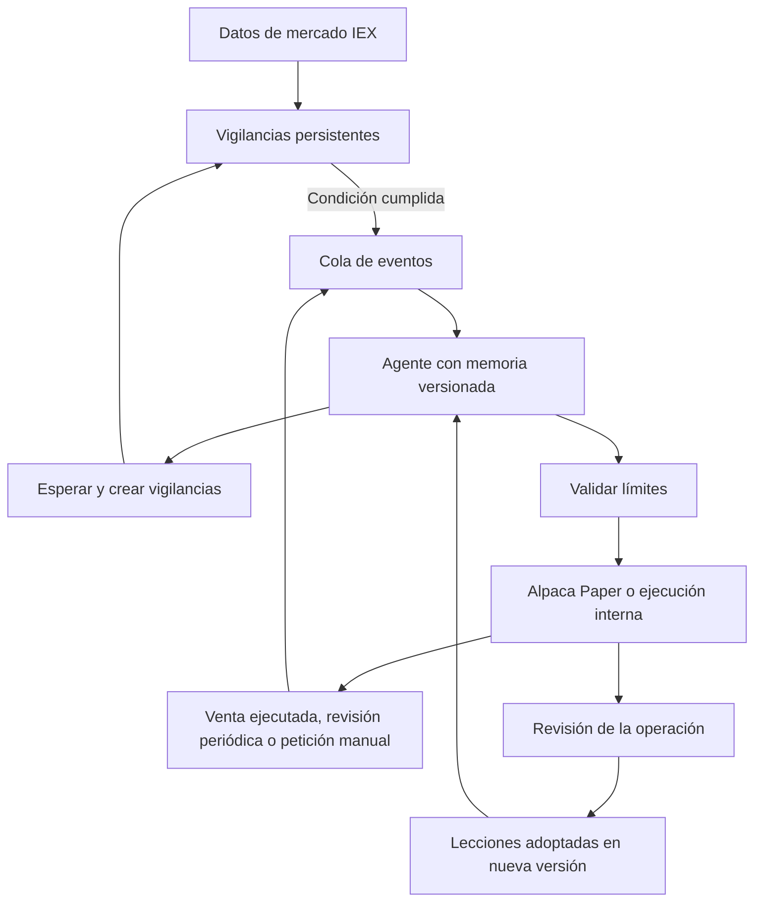

<div align="center">


# Meridian

### Un laboratorio personal para observar, evaluar y evolucionar un agente de inversión.

**Mercado por eventos · Memoria con evidencia · Autonomía con límites**

[](https://github.com/Dasge97/Meridian/actions/workflows/ci.yml)


[Inicio rápido](#inicio-rápido) · [Cómo funciona](#cómo-funciona) · [Despliegue](docs/DEPLOYMENT.md) · [Arquitectura](docs/ARCHITECTURE.md)

</div>

---

Meridian conecta un agente a **Alpaca Paper Trading** y conserva lo necesario para entender cada decisión: qué información tenía, qué esperaba, qué hizo y qué observó después. Su panel está pensado para un propietario y su servidor personal.

Hay dos simulaciones a la vez, con los mismos precios, noticias y límites. **Alpaca Paper** envía sus órdenes a la cuenta Paper y empieza en el nivel de riesgo Equilibrado. **Interna** ejecuta sus órdenes dentro de Meridian, sin enviar nada a Alpaca, y empieza en Agresivo. Así se ve qué hace el mismo agente con otro nivel de riesgo sin tocar la cuenta Paper. La pestaña Comparar las pone una al lado de la otra.

El agente puede dejarse vigilancias: «si el precio llega a X, vuelve a analizarlo». Un proceso escucha el mercado y comprueba esas condiciones sin llamar continuamente al modelo. Cuando se cumple una, el agente reevalúa; alcanzar un precio **no obliga a comprar**.

> **Estado: primera versión funcional, exclusivamente simulación.** El código no contiene un destino de trading real. Para activarlo debes configurar tus credenciales de Alpaca Paper y de un modelo compatible, desplegarlo y completar la prueba de aceptación descrita abajo. No incluye datos ni beneficios inventados.

## Qué incluye

| Área         | Funcionalidad                                                                        |
| ------------ | ------------------------------------------------------------------------------------ |
| Panel        | Patrimonio, posiciones, conexión, horario de la bolsa, llamadas y actividad          |
| Simulaciones | Alpaca Paper e Interna, cada una con su nivel de riesgo, cuenta, memoria y pausa     |
| Comparación  | Patrimonio en índice 100, resultado en USD, operaciones, acierto y tokens de las dos |
| Mercado      | Velas diarias y de 5 minutos, indicadores, resumen de la sesión y noticias           |
| Avisos       | Bot de Telegram que cuenta qué hace el agente y por qué, solo cuando importa         |
| Decisiones   | Contexto guardado, hipótesis, versión, orden y revisión posterior                    |
| Vigilancias  | Precio ≤ / ≥, caducidad, invalidación, activación única y cancelación                |
| Aprendizaje  | Lecciones que el agente saca de sus operaciones y adopta solo, hasta 15 activas      |
| Evolución    | Versiones automáticas, descartar lecciones, editar instrucciones y recuperar versión |
| Ejecución    | Órdenes limitadas de acciones enteras en Alpaca Paper o simuladas en la Interna      |
| Controles    | Límites compartidos por las dos, nivel de riesgo y pausa de cada una, sin cortos     |
| Operación    | Acceso privado, PostgreSQL persistente, Docker Compose y proceso independiente       |

## Cómo funciona



No hay un cron que decida comprar a una hora concreta. El worker mantiene un WebSocket de operaciones IEX, comprueba condiciones aproximadamente cada 2 segundos y sincroniza la cuenta cada 30 segundos. Esos intervalos son mantenimiento: las llamadas al modelo se activan por eventos o por revisiones pendientes. Mercado, velas y noticias corren en bucles separados y compartidos; cada simulación tiene además sus propios bucles de vigilancias, bróker y modelo. Una llamada al modelo no interrumpe la comprobación de condiciones, y la evaluación de una simulación no frena a la otra. Aun así, **no es un sistema de alta frecuencia**.

Con la bolsa abierta, cada simulación evalúa el mercado aunque no haya noticias ni vigilancias: cada 30 minutos en Prudente, 20 en Equilibrado, 15 en Activo y 10 en Agresivo, sin gastar las llamadas del día antes del cierre. El nivel de riesgo también dice cuándo puede esperar: en Activo y Agresivo, solo por un motivo de una lista cerrada, así que el agente opera más. Ningún nivel vende en corto.

Con la bolsa cerrada el agente no se despierta por noticias ni por vigilancias: no podría operar. Las noticias se guardan y se comentan juntas en la media hora previa a la apertura.

Las vigilancias siempre **reevalúan**, no ejecutan planes ciegamente. El agente puede comprar, vender lo que tiene o esperar; sus propuestas se validan con Zod y con límites que no puede editar. En Alpaca, cada intención tiene un `client_order_id` estable y un timeout de envío provoca pausa y reconciliación, nunca un reenvío automático. En la Interna la orden se acepta en la misma transacción que la reserva, así que no queda nada que reconciliar.

### Aprender no significa reentrenar

Esta versión emplea memoria y versiones de instrucciones; no modifica los pesos del modelo. Solo se revisan las decisiones que llegaron a enviar una orden. Esas revisiones generan **hipótesis de aprendizaje**, no verdades demostradas, y el agente las adopta sin esperar al propietario. Protecciones: como mucho 15 lecciones activas, la más antigua se retira al pasar el tope; la revisión no ve las noticias, para que ninguna regla nazca de un titular; y cada cambio crea una versión que se puede deshacer. La revisión distingue calidad de proceso, movimiento del precio y ejecución real de la orden. Cada simulación aprende por su cuenta. Las operaciones anteriores a la separación solo las revisa Alpaca, para no pagar dos veces la misma revisión.

## Inicio rápido

Requisitos: servidor Linux con Docker Engine y Compose v2, dominio/subdominio con HTTPS y salida a Alpaca y al proveedor del modelo. No necesitas instalar Node o PostgreSQL en el host.

```bash
git clone https://github.com/Dasge97/Meridian.git
cd Meridian
cp .env.example .env
openssl rand -hex 24
openssl rand -hex 32
```

Edita `.env`: usa contraseñas aleatorias distintas para PostgreSQL y el acceso al panel; usa al menos 32 caracteres aleatorios para `SESSION_SECRET`. Para `POSTGRES_PASSWORD` utiliza hexadecimal o caracteres seguros para una URL.

```dotenv
POSTGRES_PASSWORD=<valor aleatorio>
ADMIN_PASSWORD=<contraseña privada de al menos 16 caracteres>
SESSION_SECRET=<secreto aleatorio de al menos 32 caracteres>
APP_ORIGIN=https://meridian.tu-dominio.com
ALPACA_KEY_ID=<clave de una cuenta Paper exclusiva>
ALPACA_SECRET_KEY=<secreto de esa cuenta Paper>
LLM_API_KEY=<clave del proveedor>
LLM_MODEL=<modelo compatible con Chat Completions y JSON>
LLM_BASE_URL=https://api.openai.com/v1
```

No copies los marcadores `<...>` literalmente. El panel puede arrancar sin Alpaca/modelo, pero no activar el agente. Las claves se configuran en el servidor, nunca en el navegador ni en Git. Las suscripciones de chat no sustituyen necesariamente una clave API.

```bash
chmod 600 .env
docker compose up -d --build
docker compose ps
docker compose logs --tail=100 api worker
```

Configura tu proxy HTTPS hacia `http://127.0.0.1:3000`. PostgreSQL no publica ningún puerto. `APP_ORIGIN` debe coincidir exactamente con el origen del navegador, sin barra final. Para una prueba local puedes usar `http://localhost:3000`; para acceso externo usa HTTPS.

Abre el panel, inicia sesión y revisa **Configuración**. Verifica que la cuenta se sincroniza antes de pulsar **Activar agente**. La primera activación crea un evento de observación. El README de [despliegue](docs/DEPLOYMENT.md) incluye Nginx, Plesk, copias de seguridad y actualizaciones.

## Primera prueba de aceptación

1. Crea una cuenta **Paper Only exclusiva** en [Alpaca](https://app.alpaca.markets/). El saldo inicial pertenece al simulador; Meridian no ingresa ni reinicia dinero.
2. Configura sus claves y el modelo. Comprueba el saldo, el worker y la fecha del último precio en el panel.
3. Revisa los límites: los valores iniciales son para pruebas de software, no una estrategia de inversión recomendada. Si un activo cuesta más que el máximo por orden, su compra será bloqueada.
4. Activa el agente y solicita una reevaluación. Comprueba que se conserva su hipótesis y versión, aunque decida esperar.
5. Crea una vigilancia con una condición cercana al precio actual durante la sesión de mercado; comprueba que se activa una sola vez.
6. Si propone una orden, compara estado e identificador con Alpaca. Si no propone operar, no se considera un fallo.
7. Pausa y verifica que no se crean nuevas órdenes. Las ya enviadas requieren cancelación explícita.
8. Aporta una lección desde el panel y verifica que entra sola en una nueva versión. Recupera la anterior para comprobar la reversibilidad.
9. Cambia a **Interna** con el selector de la cabecera. Comprueba que tiene su propio nivel, su pausa y sus decisiones, y que sus órdenes no aparecen en Alpaca.
10. Abre **Comparar** y comprueba que las dos simulaciones salen con su resultado desde el mismo punto de partida.
11. Reinicia los contenedores y verifica la persistencia del historial y las vigilancias de las dos.

## Desarrollo y pruebas

Node 22.12+ y PostgreSQL 17+:

```bash
npm ci
npm test
npm run build
```

Exporta las variables de `.env` en tu entorno de desarrollo y define `DATABASE_URL`. Después:

```bash
npm run migrate
npm start
# Otra terminal, con las mismas variables:
npm run worker
```

`npm run dev` levanta Vite en modo desarrollo y redirige `/api` al puerto 3000. Usa su origen exacto en `APP_ORIGIN`. La aplicación no carga `.env` automáticamente fuera de Compose.

CI ejecuta pruebas, compilación, auditoría de dependencias de producción y comprobaciones de integración con PostgreSQL. Consulta [VALIDATION.md](docs/VALIDATION.md) para el alcance de la validación de esta entrega.

## Límites conocidos de esta versión

- Solo acciones/ETF estadounidenses, unidades enteras, órdenes limitadas `day`, sin cortos ni margen. No incluye cripto, fracciones, datos fundamentales ni backtesting.
- Las noticias son titulares y resúmenes de terceros. No se verifican, y el agente las recibe con el aviso de que pueden estar equivocadas o desfasadas.
- El análisis es técnico: velas diarias con medias, variaciones, volatilidad, rango de 52 semanas y volumen relativo, y la última sesión en velas de 5 minutos con precio medio ponderado por volumen y cambios a 30 y 60 minutos. No hay patrones de velas ni comparación con un índice.
- Cada llamada al modelo lleva hasta unos 30.000 tokens de contexto. Con 20 activos y una revisión cada 30 minutos, calcula del orden de un millón de tokens al día por simulación. Las dos llaman al modelo por separado, así que el gasto se dobla, y en los niveles que revisan más a menudo sube. Pon un límite de gasto en el proveedor del modelo.
- El precio del momento llega por IEX, que tiene cobertura parcial. Los precios caducan para operar tras 90 segundos; la ausencia de operaciones recientes puede bloquear decisiones legítimas. El histórico diario sí es consolidado.
- El proveedor de datos devuelve de vez en cuando velas con valores imposibles. Se descartan y se cuenta cuántas, pero ningún filtro detecta un error pequeño y verosímil.
- El panel muestra patrimonio y posiciones y compara las dos simulaciones entre sí, no con un índice ni con atribución contable por estrategia. Cambiar el saldo del simulador de Alpaca afecta la variación mostrada.
- La ejecución de la Interna es una aproximación: la orden que llega ejecutable toma el último precio y la que espera se llena a su precio límite, sin comisiones ni ejecuciones parciales, con el precio que ve el worker cada 2 segundos. Alpaca ejecuta de verdad, así que la comparación no es exacta.
- Memoria contextual y revisión cualitativa: no se ha demostrado rentabilidad ni mejora estadística. La simulación no reproduce todos los costes/ejecuciones reales.
- La pausa no liquida posiciones ni revoca una petición HTTP ya en vuelo, y solo afecta a la simulación elegida. En Alpaca, la cancelación solicita cancelar todas las órdenes de la cuenta; confirma después su estado. En la Interna cancela sus órdenes simuladas sin llamar a Alpaca.
- Un único propietario y un único worker activo. El estado vive en seis filas JSONB de PostgreSQL, en la tabla `meridian_rows`: lo compartido y cada simulación, cada uno con una fila que cambia a menudo y otra con el historial. Sencillo para un laboratorio personal, no pensado para múltiples usuarios.
- El historial está acotado a propósito, por simulación: 2.000 decisiones, 1.000 eventos y una curva de patrimonio submuestreada por hora pasados 3 días. El contexto guardado solo se conserva en las 500 decisiones más recientes. Exporta o copia la base de datos si quieres conservarlo todo.
- Las revisiones vencidas se procesan cuando el agente está activo y no hay eventos en cola, con el mismo límite diario y espera mínima. No son revisiones a una hora exacta. Cada revisión admite hasta 3 intentos.
- Las lecciones automáticas pueden equivocarse: una operación aislada no demuestra una regla. Revisa de vez en cuando la pestaña Aprendizaje y descarta lo que no tenga sentido.
- No hay motor de ejecución de código generado por IA. El agente solo puede proponer acciones tipadas y vigilancias dentro de los límites.

## Estructura

```text
src/domain.ts     Esquemas, límites de riesgo y poda del historial
src/risk.ts       Niveles de riesgo, sin dependencias
src/sims.ts       Lista de simulaciones, sin dependencias
src/sim-state.ts  Qué va en cada fila y cómo nace la Interna, sin entrada/salida
src/paper.ts      Ejecución de las órdenes de la Interna, sin entrada/salida
src/compare.ts    Comparación de las simulaciones, sin entrada/salida
src/listing.ts    Filtros y páginas de decisiones y eventos, sin entrada/salida
src/usage.ts      Consumo del modelo por llamada, sin entrada/salida
src/clock.ts      Horario de la bolsa ya calculado, sin entrada/salida
src/market.ts     Validación de velas e indicadores, sin entrada/salida
src/news.ts       Filtrado y caducidad de noticias, sin entrada/salida
src/report.ts     Qué merece un aviso y cómo se redacta, sin entrada/salida
src/telegram.ts   Envío del aviso
src/agent.ts      Transiciones de estado del worker, sin entrada/salida
src/worker.ts     Conexión de mercado, bucles compartidos y llamadas a Alpaca
src/sim-worker.ts Bucles de cada simulación: vigilancias, bróker y modelo
src/db.ts         Filas de PostgreSQL, transacciones y migración
src/server.ts     API HTTP y panel estático
web/              Panel React en español, responsive y sin datos ficticios
tests/            Validaciones de riesgo, transiciones y pruebas de integración
compose.yaml      PostgreSQL, migración, API y worker
Dockerfile        Imagen de aplicación con usuario sin privilegios
docs/             Arquitectura, despliegue y validación
```

**Propietario:** [@Dasge97](https://github.com/Dasge97) · **Proyecto:** Meridian
